# Customer Shopping Behaviour & Retail Sales Analytics

## 1. Project Overview

This project analyzes customer shopping behaviour using transactional data from **3,900 customer purchases** across multiple product categories. The analysis focuses on understanding **customer spending patterns, purchasing preferences, product categories, and subscription behavior**.

The project aims to transform raw customer transaction data into meaningful business insights that can help understand **customer behavior, identify purchasing trends, and support data-driven retail decisions**.

## 2. Dataset Summary

The dataset contains **3,900 customer purchase records** with **18 columns**, covering customer demographics, purchase information, and shopping behavior.

### Dataset Details

* **Rows:** 3,900
* **Columns:** 18
* **Missing Data:** 37 values in the `Review Rating` column

### Key Features

**Customer Demographics**

* Age
* Gender
* Location
* Subscription Status

**Purchase Details**

* Item Purchased
* Category
* Purchase Amount
* Season
* Size
* Color

**Shopping Behavior**

* Discount Applied
* Promo Code Used
* Previous Purchases
* Frequency of Purchases
* Review Rating
* Shipping Type

## 3. Exploratory Data Analysis Using Python

The project began with data preparation and initial exploratory analysis using **Python and Pandas**. The purpose of this stage was to understand the dataset structure, examine data types and missing values, and review the overall characteristics of the data.

### Data Loading

* Imported the customer shopping behaviour dataset using **Pandas**.
* Loaded the dataset into a Pandas DataFrame for further analysis.

### Initial Data Exploration

* Used `df.info()` to examine the dataset structure, column names, data types, and non-null values.

#### `df.info()` Output

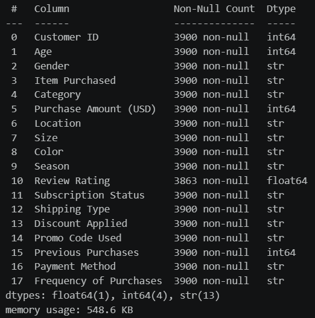

* Used `df.describe(include='all')` to generate descriptive statistics for both numerical and categorical columns.


#### `df.describe(include='all')` Output

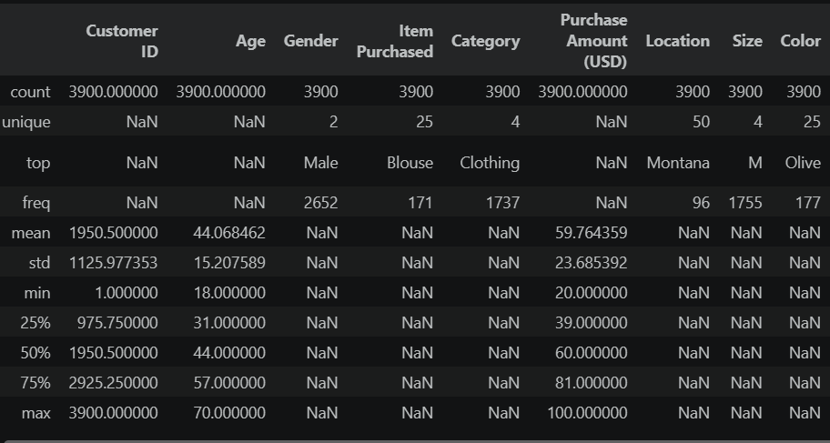

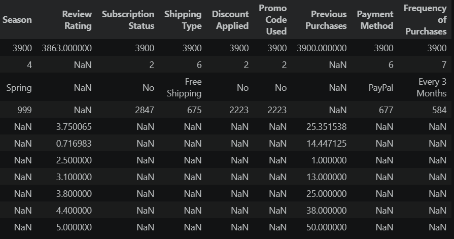

### Data Cleaning and Preparation

The dataset was cleaned and prepared using Python before performing SQL-based analysis.

#### Missing Data Handling

* Checked the dataset for missing values.
* Imputed missing values in the `review_rating` column using the **median rating within each product category**.

#### Column Standardization

* Renamed columns using **snake_case** to improve readability and maintain consistent naming throughout the analysis.

#### Feature Engineering

* Created an `age_group` column by grouping customers based on their age.
* Created a `purchase_frequency_days` column by converting purchase frequency categories into corresponding day-based values.

#### Data Consistency Check

* Compared `discount_applied` and `promo_code_used` to identify redundancy.
* Removed the `promo_code_used` column after confirming that it was redundant for the analysis.

#### Database Integration

* Established a connection between Python and **PostgreSQL**.
* Loaded the cleaned DataFrame into PostgreSQL for further SQL-based analysis.


## 4. Data Analysis Using SQL (Business Transactions)

Structured analysis was performed using **PostgreSQL** to answer key business questions related to customer purchases, revenue, discounts, subscriptions, customer segments, and shipping.

### 1. Revenue by Gender

**Business Question:** What is the total revenue generated by male vs. female customers?

**SQL Query:**

```sql
SELECT
    gender,
    SUM(purchase_amount) AS revenue
FROM customer
GROUP BY gender;
```

**Output:**

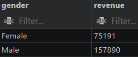

---

### 2. Revenue by Age Group

**Business Question:** What is the revenue contribution of each age group?

**SQL Query:**

```sql
SELECT
    age_group,
    SUM(purchase_amount) AS total_revenue
FROM customer
GROUP BY age_group
ORDER BY total_revenue DESC;
```

**Output:**

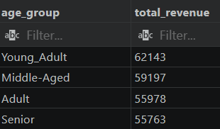

---

### 3. Revenue by Payment Method

**Business Question:** Which payment methods generate the highest total revenue?

**SQL Query:**

```sql
SELECT
    payment_method,
    COUNT(customer_id) AS total_orders,
    ROUND(SUM(purchase_amount), 2) AS total_revenue,
    ROUND(AVG(purchase_amount), 2) AS avg_purchase_amount
FROM customer
GROUP BY payment_method
ORDER BY total_revenue DESC;
```

**Output:**

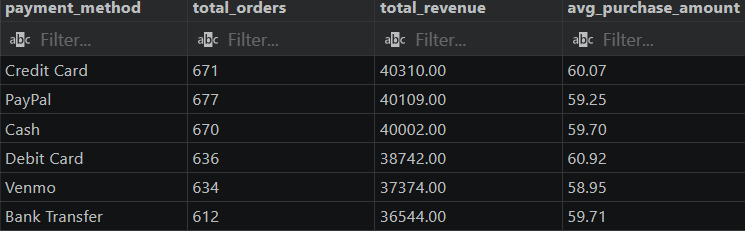

---

### 4. Revenue by Location

**Business Question:** Which locations generate the highest revenue?

**SQL Query:**

```sql
SELECT
    location,
    COUNT(customer_id) AS total_customers,
    ROUND(SUM(purchase_amount), 2) AS total_revenue,
    ROUND(AVG(purchase_amount), 2) AS avg_purchase_amount
FROM customer
GROUP BY location
ORDER BY total_revenue DESC
LIMIT 10;
```

**Output:**

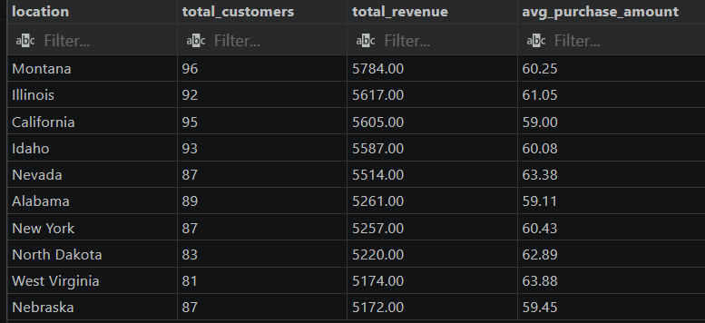

---

### 5. Revenue by Season

**Business Question:** Which seasons generate the highest revenue?

**SQL Query:**

```sql
SELECT
    season,
    COUNT(customer_id) AS total_orders,
    ROUND(SUM(purchase_amount), 2) AS total_revenue,
    ROUND(AVG(purchase_amount), 2) AS avg_purchase_amount
FROM customer
GROUP BY season
ORDER BY total_revenue DESC;
```

**Output:**

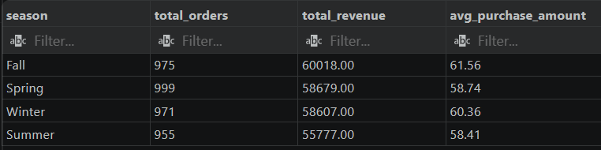

---

### 6. Top Products by Average Review Rating

**Business Question:** Which are the top 5 products with the highest average review rating?

**SQL Query:**

```sql
SELECT
    item_purchased,
    ROUND(AVG(review_rating::numeric), 2) AS "Average Product Rating"
FROM customer
GROUP BY item_purchased
ORDER BY AVG(review_rating) DESC
LIMIT 5;
```

**Output:**

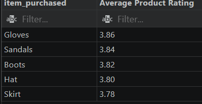

---

### 7. Top Products Within Each Category

**Business Question:** What are the top 3 most purchased products within each category?

**SQL Query:**

```sql
WITH item_counts AS (
    SELECT
        category,
        item_purchased,
        COUNT(customer_id) AS total_orders,
        ROW_NUMBER() OVER (
            PARTITION BY category
            ORDER BY COUNT(customer_id) DESC
        ) AS item_rank
    FROM customer
    GROUP BY category, item_purchased
)
SELECT
    item_rank,
    category,
    item_purchased,
    total_orders
FROM item_counts
WHERE item_rank <= 3;
```

**Output:**

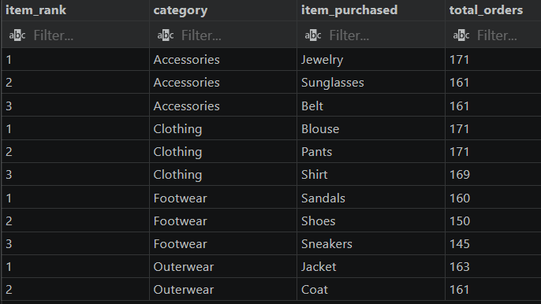

---

### 8. Discount Rate by Product

**Business Question:** Which 5 products have the highest percentage of purchases with discounts applied?

**SQL Query:**

```sql
SELECT
    item_purchased,
    ROUND(
        100.0 * SUM(
            CASE
                WHEN discount_applied = 'Yes' THEN 1
                ELSE 0
            END
        ) / COUNT(*),
        2
    ) AS discount_rate
FROM customer
GROUP BY item_purchased
ORDER BY discount_rate DESC
LIMIT 5;
```

**Output:**

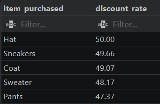

---

### 9. Discount Impact on Purchase Amount

**Business Question:** Does using a discount affect the average purchase amount?

**SQL Query:**

```sql
SELECT
    discount_applied,
    COUNT(customer_id) AS total_orders,
    ROUND(AVG(purchase_amount), 2) AS avg_purchase_amount,
    ROUND(SUM(purchase_amount), 2) AS total_revenue
FROM customer
GROUP BY discount_applied
ORDER BY avg_purchase_amount DESC;
```

**Output:**

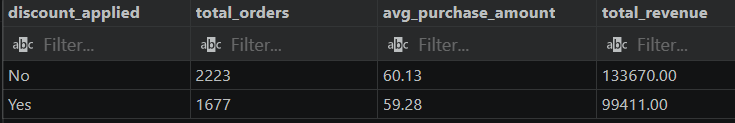

---

### 10. Discounted Purchases Above Average

**Business Question:** Which customers used a discount but still spent more than the average purchase amount?

**SQL Query:**

```sql
SELECT
    customer_id,
    purchase_amount
FROM customer
WHERE discount_applied = 'Yes'
    AND purchase_amount >= (
        SELECT AVG(purchase_amount)
        FROM customer
    );
```

**Output:**

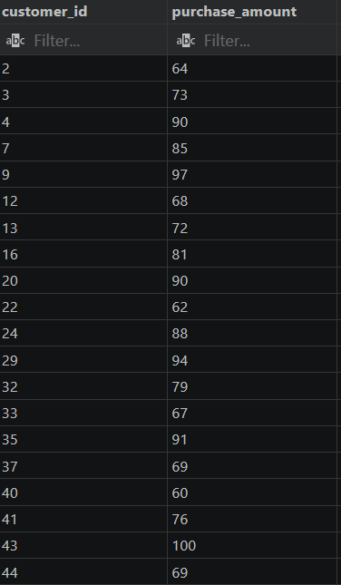

---

### 11. Subscription Spending Analysis

**Business Question:** Do subscribed customers spend more? Compare average spend and total revenue between subscribers and non-subscribers.

**SQL Query:**

```sql
SELECT
    subscription_status,
    COUNT(customer_id) AS total_customers,
    ROUND(AVG(purchase_amount), 2) AS avg_spend,
    ROUND(SUM(purchase_amount), 2) AS total_revenue
FROM customer
GROUP BY subscription_status
ORDER BY total_revenue DESC,
         avg_spend DESC;
```

**Output:**

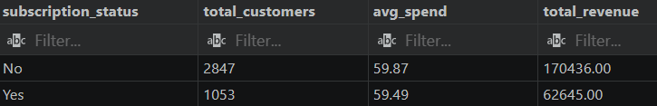

---

### 12. Repeat Buyers and Subscription

**Business Question:** Are customers who are repeat buyers (more than 5 previous purchases) also likely to subscribe?

**SQL Query:**

```sql
SELECT
    subscription_status,
    COUNT(customer_id) AS repeat_buyers
FROM customer
WHERE previous_purchases > 5
GROUP BY subscription_status;
```

**Output:**

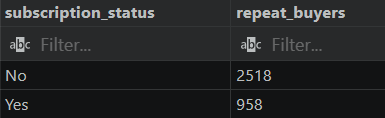

---

### 13. Customer Segmentation

**Business Question:** Segment customers into New, Returning, and Loyal based on their previous purchases.

**SQL Query:**

```sql
WITH customer_type AS (
    SELECT
        customer_id,
        previous_purchases,
        CASE
            WHEN previous_purchases = 1 THEN 'New'
            WHEN previous_purchases BETWEEN 2 AND 10 THEN 'Returning'
            ELSE 'Loyal'
        END AS customer_segment
    FROM customer
)
SELECT
    customer_segment,
    COUNT(*) AS "Number of Customers"
FROM customer_type
GROUP BY customer_segment;
```

**Output:**

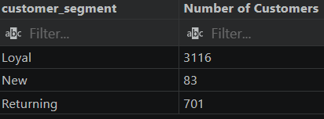

---

### 14. Revenue by Customer Segment

**Business Question:** Which customer segments generate the highest revenue?

**SQL Query:**

```sql
WITH customer_segments AS (
    SELECT
        customer_id,
        purchase_amount,
        CASE
            WHEN previous_purchases = 1 THEN 'New'
            WHEN previous_purchases BETWEEN 2 AND 10 THEN 'Returning'
            ELSE 'Loyal'
        END AS customer_segment
    FROM customer
)
SELECT
    customer_segment,
    COUNT(customer_id) AS total_customers,
    ROUND(AVG(purchase_amount), 2) AS avg_purchase_amount,
    ROUND(SUM(purchase_amount), 2) AS total_revenue
FROM customer_segments
GROUP BY customer_segment
ORDER BY total_revenue DESC;
```

**Output:**

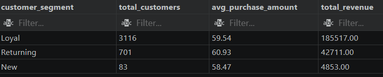

---

### 15. Purchase Amount by Shipping Type

**Business Question:** Compare the average purchase amounts between Standard and Express Shipping.

**SQL Query:**

```sql
SELECT
    shipping_type,
    ROUND(AVG(purchase_amount), 2) AS avg_purchase_amount
FROM customer
WHERE shipping_type IN ('Standard', 'Express')
GROUP BY shipping_type;
```

**Output:**

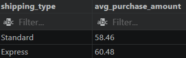


## 5. Dashboard in Power BI

An interactive dashboard was developed in **Power BI** to visualize the key findings from the customer shopping behaviour analysis.

The dashboard presents insights into **customer spending, product performance, purchasing patterns, discounts, subscriptions, and customer segments**.

### Dashboard Preview

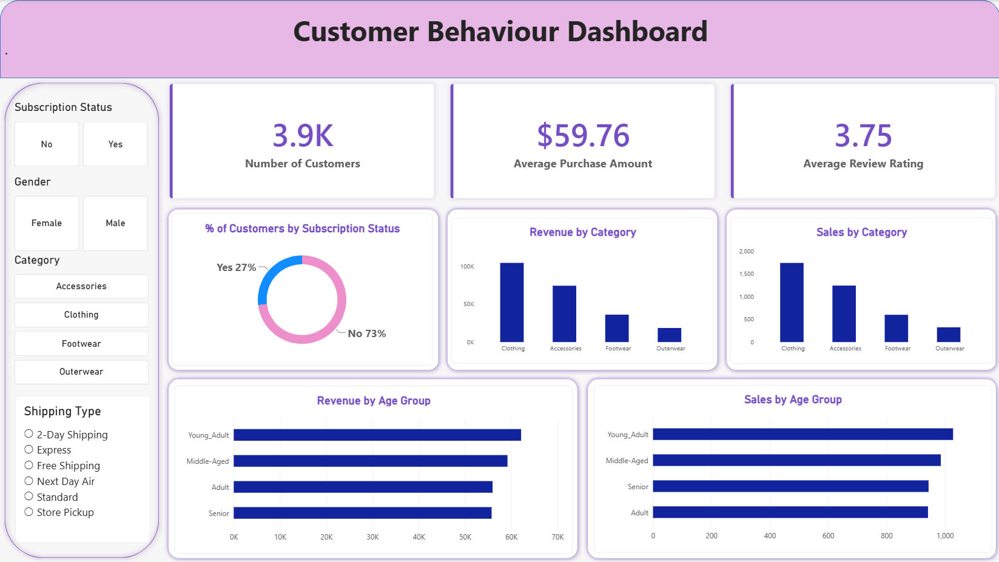

### Power BI Dashboard File

[Open Customer Shopping Behaviour Dashboard](..\Interactive_Dashboard\Customer_Shopping_behaviour.pbix)


## 6. Business Recommendations

Based on the customer shopping behaviour analysis, the following business recommendations were identified:

* **Boost Subscriptions** – Promote exclusive benefits and offers to encourage customers to subscribe.
* **Customer Loyalty Programs** – Reward repeat buyers to encourage continued purchases and progression into the **Loyal** customer segment.
* **Review Discount Policy** – Evaluate discount usage to balance customer engagement with revenue and margin considerations.
* **Product Positioning** – Highlight top-rated and frequently purchased products in marketing campaigns.
* **Targeted Marketing** – Focus marketing efforts on high-revenue customer groups and relevant purchasing patterns identified through the analysis.


## 7. Project Presentation

A professional presentation was created to summarize the **Customer Shopping Behaviour Analysis** project, covering the business problem, dataset, data preparation, exploratory analysis, SQL analysis, key insights, Power BI dashboard, and business recommendations.

### Presentation

[Open Customer Shopping Behaviour Analysis Presentation](../Presentation/Customer_Shopping_Behaviour_Analysis.pptx)

## 8. Conclusion

The **Customer Shopping Behaviour Analysis** project transformed raw customer purchase data into structured and meaningful business insights. The analysis examined customer spending patterns, product performance, discounts, subscription behaviour, customer segments, and purchasing patterns.

The project used **Python and Pandas** for data cleaning and exploratory analysis, **PostgreSQL and SQL** for structured business analysis, and **Power BI** for interactive data visualization.

Overall, the project demonstrates an end-to-end **Data Analyst workflow**, from data preparation and analysis to visualization and business recommendations. It provides a practical example of how customer transaction data can be analyzed to better understand purchasing behaviour and support data-driven business decisions.


